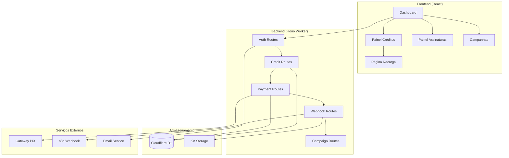
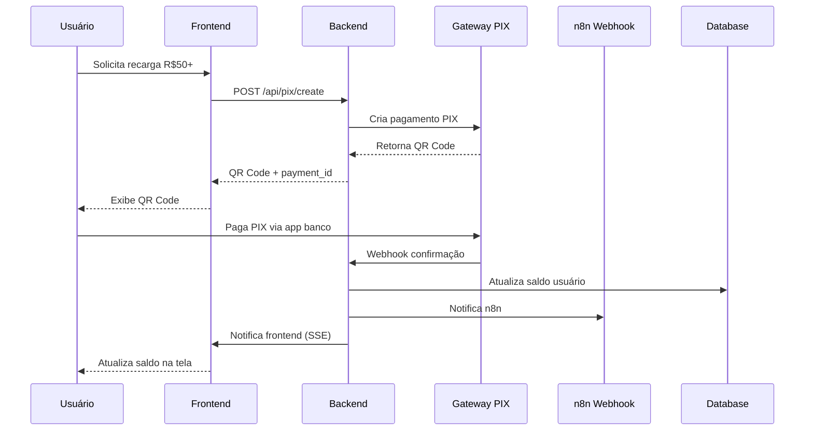

# Documento de Design - Integração PIX

## Visão Geral

Este documento detalha o design técnico para implementar um sistema completo de integração PIX no projeto EuQuero. O sistema será construído sobre a arquitetura existente (React + Hono + Cloudflare Workers) e incluirá painel de usuário, sistema de créditos, assinaturas, campanhas inteligentes e integração com webhook n8n.

## Arquitetura

### Arquitetura Geral



### Fluxo de Dados PIX



## Componentes e Interfaces

### 1. Estrutura de Banco de Dados (Cloudflare D1)

```sql
-- Tabela de painéis de usuário
CREATE TABLE user_panels (
    id TEXT PRIMARY KEY,
    user_id TEXT UNIQUE NOT NULL,
    plan TEXT DEFAULT 'free' CHECK (plan IN ('free', 'pay_per_use')),
    status TEXT DEFAULT 'active' CHECK (status IN ('active', 'suspended', 'cancelled')),
    created_at DATETIME DEFAULT CURRENT_TIMESTAMP,
    updated_at DATETIME DEFAULT CURRENT_TIMESTAMP
);

-- Tabela de créditos
CREATE TABLE credits (
    id TEXT PRIMARY KEY,
    user_id TEXT UNIQUE NOT NULL,
    balance REAL DEFAULT 3.0,
    currency TEXT DEFAULT 'BRL',
    expires_at DATETIME,
    created_at DATETIME DEFAULT CURRENT_TIMESTAMP,
    updated_at DATETIME DEFAULT CURRENT_TIMESTAMP,
    FOREIGN KEY (user_id) REFERENCES user_panels(user_id)
);

-- Tabela de transações de crédito
CREATE TABLE credit_transactions (
    id TEXT PRIMARY KEY,
    user_id TEXT NOT NULL,
    type TEXT CHECK (type IN ('credit', 'debit')),
    amount REAL NOT NULL,
    description TEXT NOT NULL,
    service TEXT NOT NULL,
    status TEXT DEFAULT 'completed' CHECK (status IN ('pending', 'completed', 'failed')),
    metadata TEXT, -- JSON
    created_at DATETIME DEFAULT CURRENT_TIMESTAMP,
    FOREIGN KEY (user_id) REFERENCES user_panels(user_id)
);

-- Tabela de pagamentos PIX
CREATE TABLE pix_payments (
    id TEXT PRIMARY KEY,
    user_id TEXT NOT NULL,
    amount REAL NOT NULL,
    payment_id TEXT UNIQUE NOT NULL, -- ID do gateway
    qr_code TEXT NOT NULL,
    qr_code_base64 TEXT,
    status TEXT DEFAULT 'pending' CHECK (status IN ('pending', 'paid', 'cancelled', 'expired')),
    expires_at DATETIME NOT NULL,
    paid_at DATETIME,
    created_at DATETIME DEFAULT CURRENT_TIMESTAMP,
    FOREIGN KEY (user_id) REFERENCES user_panels(user_id)
);

-- Tabela de campanhas
CREATE TABLE campaigns (
    id TEXT PRIMARY KEY,
    user_id TEXT NOT NULL,
    name TEXT NOT NULL,
    type TEXT NOT NULL,
    config TEXT, -- JSON
    status TEXT DEFAULT 'draft' CHECK (status IN ('draft', 'active', 'paused', 'completed')),
    credits_used REAL DEFAULT 0,
    created_at DATETIME DEFAULT CURRENT_TIMESTAMP,
    updated_at DATETIME DEFAULT CURRENT_TIMESTAMP,
    FOREIGN KEY (user_id) REFERENCES user_panels(user_id)
);

-- Tabela de logs de auditoria
CREATE TABLE audit_logs (
    id TEXT PRIMARY KEY,
    user_id TEXT,
    action TEXT NOT NULL,
    resource TEXT,
    metadata TEXT, -- JSON
    ip_address TEXT,
    user_agent TEXT,
    created_at DATETIME DEFAULT CURRENT_TIMESTAMP
);

-- Índices para performance
CREATE INDEX idx_credits_user_id ON credits(user_id);
CREATE INDEX idx_transactions_user_id ON credit_transactions(user_id);
CREATE INDEX idx_transactions_created_at ON credit_transactions(created_at);
CREATE INDEX idx_payments_user_id ON pix_payments(user_id);
CREATE INDEX idx_payments_status ON pix_payments(status);
CREATE INDEX idx_campaigns_user_id ON campaigns(user_id);
CREATE INDEX idx_audit_logs_user_id ON audit_logs(user_id);
CREATE INDEX idx_audit_logs_created_at ON audit_logs(created_at);
```

### 2. Tipos TypeScript Estendidos

```typescript
// src/shared/types.ts - Extensões

export interface UserPanel {
  id: string;
  userId: string;
  plan: 'free' | 'pay_per_use';
  status: 'active' | 'suspended' | 'cancelled';
  createdAt: Date;
  updatedAt: Date;
}

export interface PixPayment {
  id: string;
  userId: string;
  amount: number;
  paymentId: string;
  qrCode: string;
  qrCodeBase64?: string;
  status: 'pending' | 'paid' | 'cancelled' | 'expired';
  expiresAt: Date;
  paidAt?: Date;
  createdAt: Date;
}

export interface Campaign {
  id: string;
  userId: string;
  name: string;
  type: string;
  config: Record<string, any>;
  status: 'draft' | 'active' | 'paused' | 'completed';
  creditsUsed: number;
  createdAt: Date;
  updatedAt: Date;
}

export interface AuditLog {
  id: string;
  userId?: string;
  action: string;
  resource?: string;
  metadata?: Record<string, any>;
  ipAddress?: string;
  userAgent?: string;
  createdAt: Date;
}

export interface WebhookPayload {
  event: 'user_created' | 'payment_confirmed' | 'credits_added' | 'campaign_executed';
  userId: string;
  data: Record<string, any>;
  timestamp: Date;
}

// Schemas de validação
export const PixPaymentSchema = z.object({
  amount: z.number().min(50, "Valor mínimo de R$ 50"),
  userId: z.string().min(1, "ID do usuário obrigatório"),
});

export const CampaignSchema = z.object({
  name: z.string().min(3, "Nome deve ter pelo menos 3 caracteres"),
  type: z.string().min(1, "Tipo obrigatório"),
  config: z.record(z.any()).optional(),
});

export const DebitCreditsSchema = z.object({
  userId: z.string().min(1, "ID do usuário obrigatório"),
  amount: z.number().positive("Valor deve ser positivo"),
  description: z.string().min(1, "Descrição obrigatória"),
  service: z.string().min(1, "Serviço obrigatório"),
});
```

### 3. Componentes React

#### Dashboard Principal
```typescript
// src/react-app/components/Dashboard.tsx
interface DashboardProps {
  user: User;
}

interface DashboardState {
  panel: UserPanel | null;
  credits: CreditBalance | null;
  isLowBalance: boolean;
  campaigns: Campaign[];
}
```

#### Painel de Créditos
```typescript
// src/react-app/components/CreditsPanel.tsx
interface CreditsPanelProps {
  balance: number;
  isLowBalance: boolean;
  transactions: CreditTransaction[];
  onRecharge: () => void;
}
```

#### Página de Recarga PIX
```typescript
// src/react-app/pages/Recarga.tsx
interface RecargaState {
  amount: number;
  pixPayment: PixPayment | null;
  isGenerating: boolean;
  paymentStatus: 'idle' | 'pending' | 'paid' | 'expired';
}
```

### 4. Rotas da API (Hono)

#### Rotas de Painel do Usuário
```typescript
// GET /api/panel/:userId - Buscar painel do usuário
// POST /api/panel - Criar painel (automático no cadastro)
// PUT /api/panel/:userId - Atualizar plano
```

#### Rotas de Créditos
```typescript
// GET /api/credits/:userId - Buscar saldo
// GET /api/credits/:userId/transactions - Histórico
// POST /api/credits/debit - Debitar créditos
// POST /api/credits/credit - Creditar (interno)
```

#### Rotas PIX
```typescript
// POST /api/pix/create - Gerar pagamento PIX
// GET /api/pix/:paymentId/status - Status do pagamento
// POST /api/webhooks/pix - Webhook do gateway
```

#### Rotas de Campanhas
```typescript
// GET /api/campaigns/:userId - Listar campanhas
// POST /api/campaigns - Criar campanha
// PUT /api/campaigns/:id - Atualizar campanha
// POST /api/campaigns/:id/execute - Executar campanha
```

#### Webhook n8n
```typescript
// POST /api/webhooks/n8n - Enviar notificações
```

## Modelos de Dados

### 1. Serviço de Créditos

```typescript
class CreditService {
  async getBalance(userId: string): Promise<CreditBalance>
  async debitCredits(userId: string, amount: number, description: string, service: string): Promise<boolean>
  async creditUser(userId: string, amount: number, description: string): Promise<void>
  async getTransactions(userId: string, limit?: number): Promise<CreditTransaction[]>
  async isLowBalance(userId: string): Promise<boolean>
}
```

### 2. Serviço PIX

```typescript
class PixService {
  async createPayment(userId: string, amount: number): Promise<PixPayment>
  async getPaymentStatus(paymentId: string): Promise<string>
  async processWebhook(payload: any): Promise<void>
  async expireOldPayments(): Promise<void>
}
```

### 3. Serviço de Webhook

```typescript
class WebhookService {
  async sendToN8n(payload: WebhookPayload): Promise<boolean>
  async retryFailedWebhooks(): Promise<void>
  private async logWebhookAttempt(payload: WebhookPayload, success: boolean): Promise<void>
}
```

### 4. Serviço de Auditoria

```typescript
class AuditService {
  async log(action: string, userId?: string, metadata?: any, request?: Request): Promise<void>
  async getLogs(userId?: string, limit?: number): Promise<AuditLog[]>
  async cleanOldLogs(daysToKeep: number): Promise<void>
}
```

## Tratamento de Erros

### 1. Hierarquia de Erros

```typescript
class AppError extends Error {
  constructor(
    public message: string,
    public statusCode: number = 500,
    public code?: string
  ) {
    super(message);
  }
}

class ValidationError extends AppError {
  constructor(message: string) {
    super(message, 400, 'VALIDATION_ERROR');
  }
}

class InsufficientCreditsError extends AppError {
  constructor() {
    super('Créditos insuficientes', 402, 'INSUFFICIENT_CREDITS');
  }
}

class PaymentError extends AppError {
  constructor(message: string) {
    super(message, 402, 'PAYMENT_ERROR');
  }
}
```

### 2. Middleware de Tratamento

```typescript
const errorHandler = async (err: Error, c: Context) => {
  // Log do erro
  await auditService.log('error', undefined, {
    error: err.message,
    stack: err.stack,
    url: c.req.url,
    method: c.req.method
  }, c.req);

  if (err instanceof AppError) {
    return c.json({
      success: false,
      message: err.message,
      code: err.code
    }, err.statusCode);
  }

  // Erro genérico - não expor detalhes
  return c.json({
    success: false,
    message: 'Erro interno do servidor'
  }, 500);
};
```

## Estratégia de Testes

### 1. Testes Unitários
- Serviços de crédito, PIX e webhook
- Validações Zod
- Utilitários de formatação

### 2. Testes de Integração
- Fluxo completo de recarga PIX
- Webhook do gateway de pagamento
- Notificações para n8n

### 3. Testes E2E
- Jornada completa do usuário
- Recarga e uso de créditos
- Criação e execução de campanhas

### 4. Testes de Segurança
- Validação de entrada
- Prevenção de ataques de injeção
- Autenticação e autorização

## Configuração de Ambiente

### 1. Variáveis de Ambiente

```bash
# Gateway PIX (Mercado Pago)
MP_ACCESS_TOKEN=your_mp_token
MP_PUBLIC_KEY=your_mp_public_key
MP_WEBHOOK_SECRET=your_webhook_secret

# n8n Webhook
N8N_WEBHOOK_URL=https://n8n.iau2.com.br/webhook-test/euquero
N8N_WEBHOOK_SECRET=optional_secret

# Database
DATABASE_URL=your_d1_database_url

# Email Service
EMAIL_API_KEY=your_email_service_key
EMAIL_FROM=noreply@euquero.com

# Security
JWT_SECRET=your_jwt_secret
ENCRYPTION_KEY=your_encryption_key
```

### 2. Configuração Cloudflare Workers

```toml
# wrangler.toml
[env.production]
vars = { ENVIRONMENT = "production" }

[[env.production.d1_databases]]
binding = "DB"
database_name = "euquero-prod"
database_id = "your-database-id"

[[env.production.kv_namespaces]]
binding = "CACHE"
id = "your-kv-namespace-id"
```

## Monitoramento e Observabilidade

### 1. Métricas
- Taxa de conversão PIX
- Tempo de processamento de pagamentos
- Taxa de sucesso de webhooks
- Uso de créditos por usuário

### 2. Logs
- Todas as transações financeiras
- Tentativas de webhook
- Erros de sistema
- Ações de usuário

### 3. Alertas
- Falhas de pagamento
- Webhooks falhando
- Saldo baixo de usuários
- Erros críticos do sistema