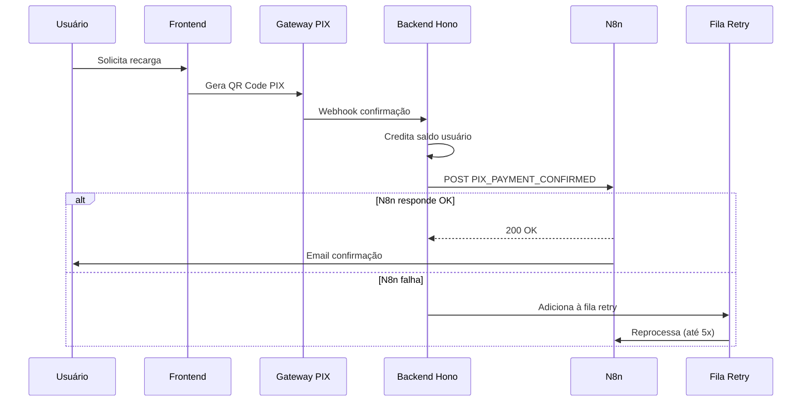

# Configuração do Webhook PIX com N8n

## Visão Geral

Este sistema implementa um webhook PIX seguro com retry automático e notificação para o N8n, seguindo as melhores práticas de segurança.

## Fluxo do Sistema



## Endpoints Implementados

### 1. Webhook PIX
- **URL**: `POST /api/webhooks/pix`
- **Função**: Recebe confirmação de pagamento PIX
- **Segurança**: Validação com Zod schema

### 2. Fila de Retry
- **URL**: `GET /api/webhooks/retry-queue`
- **Função**: Processa itens pendentes na fila
- **Uso**: Pode ser chamado por cron job

### 3. Status da Fila
- **URL**: `GET /api/webhooks/queue-status`
- **Função**: Monitora status da fila de retry

## Configuração

### 1. Variáveis de Ambiente

Adicione no arquivo `.env`:

```env
# Webhook PIX e N8n
INTERNAL_SECRET=seu_segredo_interno_super_seguro_aqui_123456
N8N_WEBHOOK_URL=https://webhook.iau2.com.br/webhook/euquero
```

### 2. Payload do Webhook PIX

O sistema espera receber do gateway de pagamento:

```json
{
  "data": {
    "id": "payment_123456"
  },
  "metadata": {
    "user_id": "user_uuid_here"
  },
  "transaction_amount": 50.00,
  "status": "approved"
}
```

### 3. Payload Enviado para N8n

O sistema envia para o N8n:

```json
{
  "event": "PIX_PAYMENT_CONFIRMED",
  "user_id": "user_uuid_here",
  "payment_id": "payment_123456",
  "amount": 50.00,
  "timestamp": "2025-01-09T14:00:00.000Z"
}
```

## Configuração do N8n

### 1. Webhook Node
- **URL**: `https://webhook.iau2.com.br/webhook/euquero`
- **Método**: POST
- **Autenticação**: Bearer Token (usar INTERNAL_SECRET)

### 2. Workflow Sugerido

```json
{
  "nodes": [
    {
      "name": "Webhook PIX",
      "type": "n8n-nodes-base.webhook",
      "parameters": {
        "httpMethod": "POST",
        "path": "euquero",
        "authentication": "headerAuth"
      }
    },
    {
      "name": "Validar Dados",
      "type": "n8n-nodes-base.function",
      "parameters": {
        "functionCode": "// Validar se é evento PIX_PAYMENT_CONFIRMED\nif (items[0].json.event !== 'PIX_PAYMENT_CONFIRMED') {\n  throw new Error('Evento inválido');\n}\n\nreturn items;"
      }
    },
    {
      "name": "Enviar Email",
      "type": "n8n-nodes-base.emailSend",
      "parameters": {
        "toEmail": "={{ $json.user_email }}",
        "subject": "Pagamento PIX Confirmado ✅",
        "text": "Olá,\\n\\nConfirmamos o recebimento do seu pagamento PIX de R$ {{ $json.amount }}.\\n\\nSeu saldo já foi atualizado no painel.\\n\\nAtenciosamente,\\nEquipe EuQuero"
      }
    }
  ]
}
```

## Segurança Implementada

### 1. Backend Seguro
- ✅ Webhook PIX não exposto no frontend
- ✅ Autenticação via Bearer Token para N8n
- ✅ Validação de entrada com Zod schemas
- ✅ Logs de auditoria para todas as operações

### 2. Retry Resiliente
- ✅ Fila de retry automático (até 5 tentativas)
- ✅ Processamento assíncrono
- ✅ Monitoramento de status

### 3. Fail-Safe
- ✅ Crédito do usuário sempre processado primeiro
- ✅ Notificação N8n é secundária (não bloqueia o pagamento)
- ✅ Logs detalhados para debugging

## Monitoramento

### 1. Logs de Auditoria
Todos os eventos são logados:
- `PIX_WEBHOOK_RECEIVED`: Webhook recebido
- `PIX_PAYMENT_PROCESSED`: Pagamento processado

### 2. Métricas da Fila
- Itens pendentes
- Itens processados
- Itens com falha
- Última execução

## Deployment

### 1. Cloudflare Workers
O sistema está pronto para deploy no Cloudflare Workers:

```bash
npm run build
npm run deploy
```

### 2. Cron Job (Opcional)
Para processar a fila automaticamente, configure um cron job:

```bash
# A cada 5 minutos
*/5 * * * * curl -X GET https://seu-dominio.com/api/webhooks/retry-queue
```

## Testes

### 1. Testar Webhook PIX
```bash
curl -X POST https://seu-dominio.com/api/webhooks/pix \
  -H "Content-Type: application/json" \
  -d '{
    "data": {"id": "test_payment_123"},
    "metadata": {"user_id": "test_user_456"},
    "transaction_amount": 50.00,
    "status": "approved"
  }'
```

### 2. Testar Fila de Retry
```bash
curl -X GET https://seu-dominio.com/api/webhooks/retry-queue
```

### 3. Verificar Status
```bash
curl -X GET https://seu-dominio.com/api/webhooks/queue-status
```

## Próximos Passos

1. **Integração com Supabase**: Substituir simulação por banco real
2. **Redis/Upstash**: Para fila de retry mais robusta
3. **Webhooks de Status**: Notificar sobre falhas na fila
4. **Dashboard**: Interface para monitorar webhooks
5. **Rate Limiting**: Proteção contra spam de webhooks